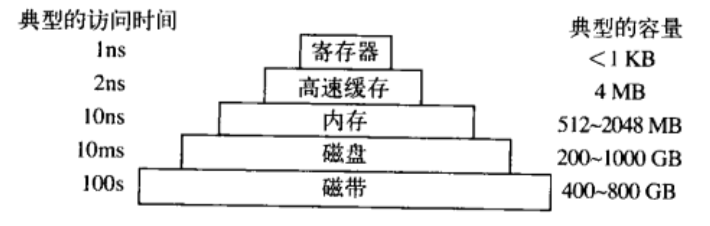

# 1.引论
概览：
- 1.1 什么是操作系统
- 1.2 操作系统的历史
- 1.3 计算机硬件
- 1.4 操作系统大观园
- 1.5 操作系统概念
- 1.6 系统调用
- 1.7 操作系统结构
- 1.8 依靠C的世界

概念：
- 内核态：操作系统具有对所有硬件的完全访问权，可以执行机器能够运行的任何指令。
- 用户态：只使用了机器指令中的一个子集，会影响机器的控制或可进行I/O操作的指令，在用户态的程序里是禁止的。

## 1.1 什么是操作系统
- 作为扩展机器的操作系统：对硬件进行良好、清晰、优雅的抽象并提供给程序（程序员）。
- 作为资源管理者的操作系统：在相互竞争的程序之间有序地控制对处理器、存储器以及其他I/O接口设备的分配。

## 1.2 操作系统的历史
- 第一代：真空管和穿孔卡片
- 第二代：晶体管和批处理系统
- 第三代：集成电路芯片和多道程序设计
- 第四代：个人计算机

## 1.3 计算机硬件
- CPU
- 存储器
  - 寄存器（位于CPU）
  - 高速缓存
  - 主存/内存/RAM
- 磁盘
- 磁带
- I/O设备（包括设备控制器和设备本身）
- 总线
- 

## 1.4 操作系统大观园
- 大型操作系统
- 服务器操作系统
- 多处理器操作系统
- 个人计算机操作系统
- 掌上计算机操作系统
- 嵌入式操作系统
- ...

## 1.5 操作系统概念
- 进程
- 地址空间
- 文件
- 保护（权限）
- shell 
## 1.6 系统调用
## 1.7 操作系统结构
- 虚拟机（是裸机硬件的精确复制品）
- 外核（给每个用户整个资源的一个子集）

## 1.8 依靠C的世界
- C语言
- 头文件
- 大型编程项目
  - .h/.c文件 -> C预处理器 -> 编译器 -> .o文件 -> linker程序 -> .out文件

问题：
- 在多核CPU下，同一进程下的多个线程可以并行运行吗
