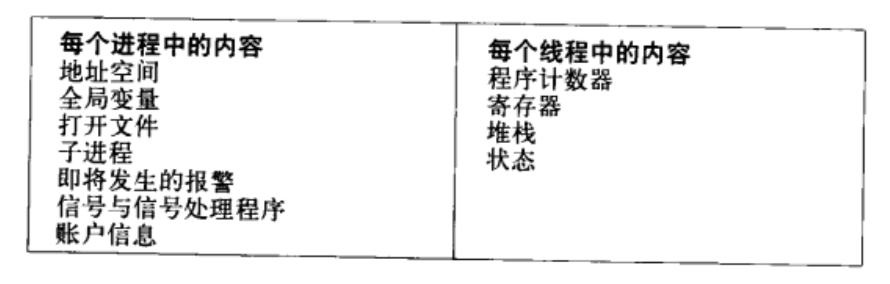

# 2.进程与线程
概览：
- 2.1 进程
- 2.2 线程
- 2.3
- 2.4
- 2.5
- 2.6
- 2.7
- 2.8

概念：
- 

## 2.1 进程
- 进程模型
- 创建进程
- 进程的终止
- 进程的层次结构（父子关系，Windows中没有这个概念）
- 进程的状态
- 进程的实现

## 2.2 线程
- 线程的使用
  - 功效同一个地址空间和所有可用数据
  - 创建线程比创建进程快10-100倍
- 经典线程模型
  - 
- POSIX线程
- 在用户控件中实现线程
- 在内核中实现线程
- 混合实现
- 弹出式线程（由一个线程控制创建更多的线程）
- 使单线程代码多线程化

## 进程间通信