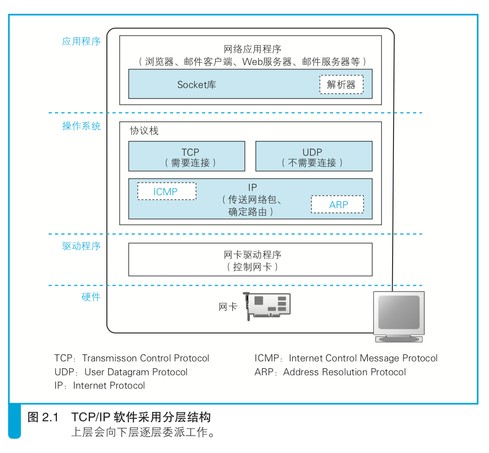
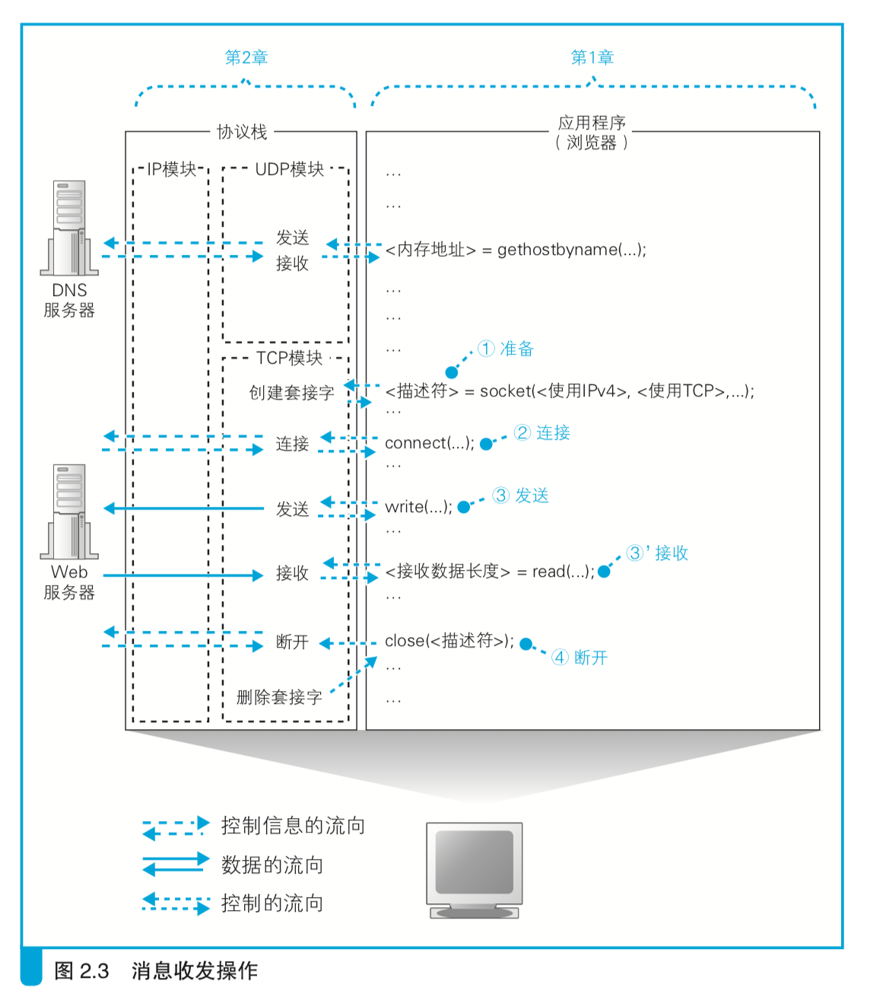

# 2.用电信号传输TCP/IP数据
概览：
- 2.1 创建套接字
- 2.2 连接服务器
- 2.3 收发数据
- 2.4 从服务器断开并删除套接字
- 2.5 IP与以太网的包收发操作
- 2.6 UDP协议的收发操作

## 2.1 创建套接字
- 协议栈的内部结构
  - 
  - Socket库中包括解析器来向DNS服务器发出查询
- 套接字的实体就是通信控制信息
  - 在协议栈内部有一块用于存放控制信息的内存空间
  - 控制信息包括通信对象的IP、端口号、通信操作的进行状态
- 调用socket时的操作
  - 

## 2.2 连接服务器
- 连接是什么意思
  - 连接实际上是通信双方交换控制信息，在套接字中记录必要信息
  - 负责保存控制信息的头部
    - 以太网和IP的控制信息
    - TCP的控制信息